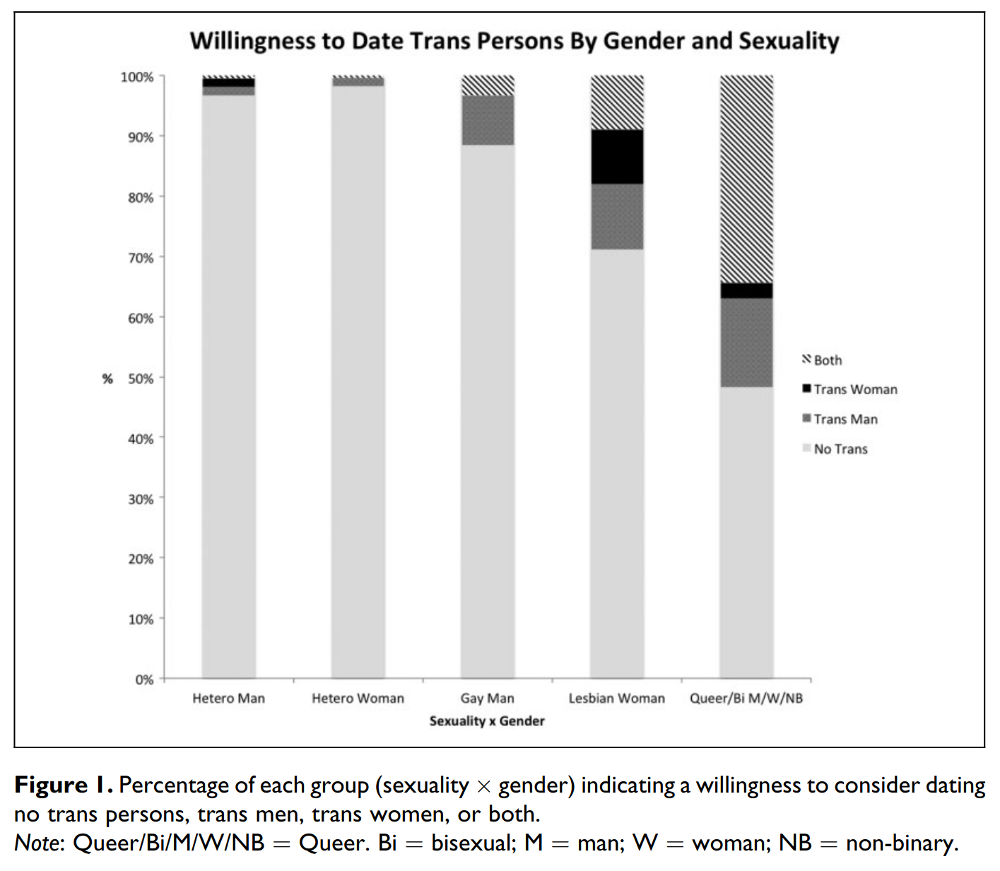
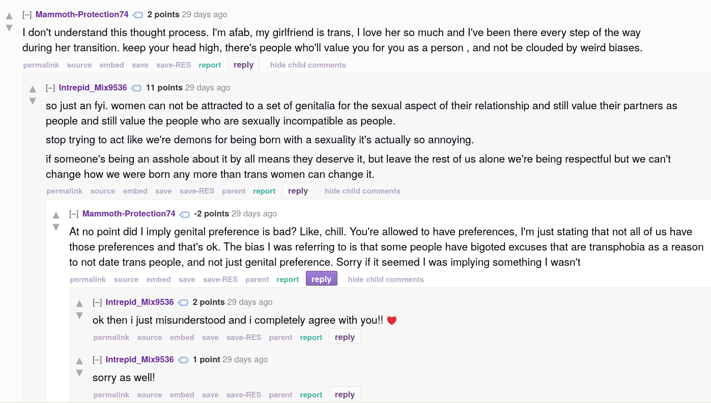
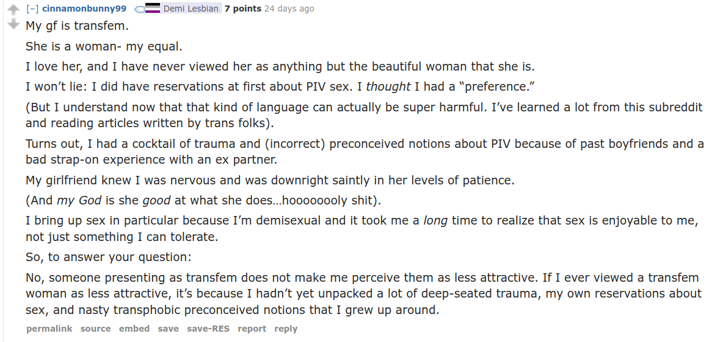

# Is a "genital preference" transphobic or what?

Dr Devon Price wrote a really good article titled "I'm trans, but I have a genital preference. What should I do?"[^devon_price] It takes a very practical approach to dealing with this concept from the perspective of someone who has a genital preference. I would recommend reading the article, it's very good! An anonymous trans guy says "i find myself turned off/repulsed by penises and cum" and Devon answers that it is important to respect your own boundaries, and that even if your preferences and boundaries are informed by the prevailing prejudices of the day you shouldn't force yourself to disregard your feelings. And he is entirely correct in this, obviously. Sex is ultimately about pleasure and enjoyment. Disregarding your own boundaries is unlikely to be pleasurable and likely to hurt everyone involved. But instead of communicating what things repulse you, a better approach would be to communicate the things you desire.

> instead of worrying about whether we desire people in the “right” ways, we can simply communicate which activities are sexually enjoyable to us
> — Dr Devon Price

A positive approach to sex, where you communicate what you desire instead of what repulses you is a huge win/win. You get better sex, and the people who's bodies you find repulsive don't have to hear about how your find their bodies repulsive. It solves the problem, but it dodges the question. Is a "genital preference" transphobic or what?

A 2018 paper titled "Transgender exclusion from the world of dating"[^blair_and_hoskins] asked 958 participants "Who would you consider dating?" and let them pick from a multiple choice section.

The results show two things. There exists an overwhelming transphobic bias against trans people in all sexual demographics and there exists a transmisogynistic bias against trans women among the people who are willing to date trans people.

> Across a sample of heterosexual, lesbian, gay, bisexual, queer, and trans individuals, 87.5% indicated that they would not consider dating a trans person, with cisgender heterosexual men and women being most likely to exclude trans persons from their potential dating pool. 
> [..]
> When individuals are willing to consider including trans persons within their pool of prospective dating partners, there appears to be a bias toward including trans men but not trans women, even if doing so is counter to one’s self-identified sexual and/or gender identity.
> — Karen L. Blair and Rhea Ashley Hoskin

It is critical to understand that concepts such as "are traps gay?" or "having a genital preference" do not exist in a vacuum. They exist within a culture of transphobia and transmisogyny. Asking "are genital preferences transphobic" is in a way the wrong question to approach the topic. Of course sexuality is complex and we must be careful not to overly moralize personal sexual and romantic choices. But we should be asking ourselves, why do these discrepancies exist? Are heterosexuals' lack of interest in trans partners simply an expression of desire? Among those who are interested in trans partners, why does there exist such a bias for trans men over trans women? Why do so many self-identified lesbians extend their sexuality to include trans men, but not trans women?

I don't think it's controversial to say that heterosexuals' lack of interest in trans people as partners is, at least in part, fueled by transphobia. Back when "super-straight"[^super straight] was a thing for a few months, it was widely understood that this was a way to mask transphobic goals in progressive language. In the original video by "Kyleroyce" where he invents the label he says "now I'm super straight; I only date the opposite gender, woman, that are born women. So you can't say I'm transphobic now because that's just my sexuality y'know."[^kyleroyce] The label is explicitly created as a way to dodge criticism. Criticism which is well earned, how could you possibly claim that you *know* you are attracted to 0 out of ~80 million people[^trans_population]. He's not really saying "if I were to meet every trans person, I would not be attracted to any of them at all". He's stating an intention: "If I am interested in someone and they tell me they're transgender, I will stop pursuing them"[^outing]. That intention may be a reflection of some deeply held repulsion. He may find the idea of dating or having sex with a trans woman revolting and therefore be unwilling to date trans people. In that case he is also stating a repulsion. It's important to note that he is not expressing a positive desire for cis women or vulva. This leads me to ask the following questions. Why did these men feel the need to state their intention to exclude trans women from their dating pool? Why do some men feel repulsed by trans women? Why do those men feel the need to state their repulsion?

[^kyleroyce]: https://youtu.be/oRRjnMlkgXc

I don't know if I have good answers. Transmisogyny is a good blanket answer but it doesn't engage with it much. The effect of creating and repeating a meme that states "trans women are romantically and sexually repulsive" is clearer to me. It makes trans women more isolated and vulnerable, it sets us up to accept any romantic or sexual interest. If barely anyone finds us attractive enough to have sex with, we should settle for whatever we can get. This makes it easier to abuse or exploit trans women. It makes trans women believe that they are gross, which has many negative psychological effects. This is of course not exclusive to trans women at all, the same effects are seen for other trans people with other memes. The LGBAlliance twitter account made a [version of this meme](https://x.com/ALLIANCELGB/status/1368477182490738688) which included "super lesbian", "super gay" and "super bi"[^super_bi], so you can hit any trans person with these really. Maybe instead I should be asking what is the effect of this meme spreading in our society?

Further stigmatization of trans people.
### ok but is a "genital preference" transphobic or fucking what?

I don't think the everyone who uses the concept of "genital preference" is maliciously enacting transphobia with a conscious goal of further stigmatizing trans people. Despite this the concept or its use can still be transphobic in cause and effect. I will focus on lesbians using this concept online as that is what I have experienced the most. When I came out as an young trans woman, I had no one I trusted to help me learn about queernes, transfeminity or lesbianism (which was the sexuality i fell into as someone who loved women and was now a woman herself). Like many other transfem nerds I used Reddit because it had good content about my interests, and it so happened to have a bunch of queer subreddits. I learnt what it meant to be a trans woman and a lesbian from r/actuallesbians, r/LesbianActually and r/traaaaaaannnnnnnnnns. There are a lot of transfems in these spaces (relative to what I see in real life lesbian spaces), a lot of recently out queers (<2 years) and a lot of people who have no real life network of queers. It is simultaneously a very trans accepting space and one where transphobia is normalized. There are rules against transphobia, and transphobia is usually swiftly deleted. There are plenty of trans positive posts about how trans women are as desirable and authentically female as cis women. But these posts reveal the cultural norm that exists. Why do we need to keep saying it? Because there are many cis lesbians who are not on board. Every post that talks about the second-class womanhood that trans women experience in these spaces has comments about how "genital preferences are valid". I've compiled some examples.

[Source](https://old.reddit.com/r/LesbianActually/comments/1fn79k2/oh_my_god_lesbians_scare_me/log6s1z/)

(Reddit comments are indented one level each time you reply to a comment. This screenshot depicts 2 people going back and fourth twice, and a final bonus message by Intrepid_Mix9536 because they reply to the same message twice.)

In this post a trans woman describes that she is struggling with being turned down for her genitalia and her transness (not pictured). This AFAB person encourages OP to keep looking and to disregard potential lovers' "weird biases". They get 1 upvote[^reddit_points]. A third user replies to defend genital preferences, and tells this person to "stop trying to act like we're demons for being born with a sexuality". This has 11 points. Telling trans women that we are desirable partners and that we have value as people despite what some lesbians think about our bodies is not a belief that receives upvotes on this subreddit. A genital preference is described here as an innate quality that you are born with and that cannot be changed, it is as deeply held as a trans woman's gender or any other part of sexuality. Questioning any of this is depicted as undermining lesbian sexuality. In effect, the concept of genital preference as a natural and unquestionable extension of sexuality is used as a tool to put a trans women back in their place as second-class subjects of lesbian sexuality.

[^reddit_points]: On reddit comments start at 1 points, because you automatically upvote your own post. Every subsequent upvote/downvote adds or subtracts one point from the total. So we don't really know how many people up- or downvoted the post, just that the total is a small positive.

These types of comments and discussion were common back when I actually frequented Reddit in ~2019. The narrative says that some cis lesbians may not have a "genital preference" and be so kind that they will consider trans women as potential partners, but ultimately you should not expect lesbians to consider trans women as part of their dating pool. This reflects the status quo, lesbians (and everyone else), by and large, do not consider trans people and especially trans women potential partners. The effect of perpetuating this narrative is the same as the narrative of super straightness, it isolates and devalues trans women and makes us vulnerable to abuse.

But not everyone is using this meme[^meme] to bash at trans women who are asking for support in lesbian forums. Some lesbians proclaim that they don't have a genital preference, which is used to mean that they are willing to have sex with people who have penises. What is missing is lesbians using this to describe an attraction towards penis. We actually see the same pattern here as with men who use "super straight" as a label; the meme is used to describe a negative intention to exclude trans women, instead of a positive intention to include cis women or, importantly, trans women. The word itself is shaped in a way that implies a positive inclusion, it's a preference, but it isn't used to describe liking vulva. It declares an intention to exclude trans women from ones dating pool, and that intention may be a reflection of some deeply held repulsion.

[Source](https://old.reddit.com/r/actuallesbians/comments/1fzehup/people_not_knowing_im_trans/lr3s3d2/)

In a different post, a lesbian describes how she thought she had a preference, but eventually came to understand that she had a "cocktail of trauma and (incorrect) preconceived notions about PIV". She explicitly says that transphobic notions she grew up around fueled this. In private discussions with other lesbians and AFAB queers, I've often been told similar stories. Men, who often have penises, have contributed to a lot of sexual trauma in our society. So it's not surprising that many queers would have some repulsion to genitalia with so much harm connected to it. But penises are not the perpetrators of sexual assault, people are. And our collective repulsion to penis is harming part of our community, whether it stems from trauma or from transphobia or some complex combination. I think we should try to move forward, and look inward. Why do you feel the way you feel about penis?

I don't expect that we would all be into penis if we did the necessary soul searching, but maybe we could change the way we talk about genitalia to be similar to every other part of people's bodies and our own sexuality. Blue eyes, black hair, penis, a loud personality, small boobs, body hair and shyness could all be characteristics that interest you or don't on an equal footing. We could move away from this phallocentric focus on penis and have a more holistic approach to sexuality, and I think we'd all be better off.

[^devon_price]: https://drdevonprice.substack.com/p/im-trans-but-i-have-a-genital-preference
[^blair_and_hoskins]: https://sci-hub.se/10.1177/0265407518779139
[^super_straight]: ["super straight"](https://glaad.org/super-straight-definition-meaning-anti-lgbt-online-hate/) was a sexuality [started](https://www.businessinsider.com/super-straight-flag-meaning-tiktok-superstraight-ss-movement-origin-2021-3) in 2021 on TikTok that is defined as straight people who only date cis people. The label died very quickly and was never widely used.
[^trans_population]: I'm estimating that 1% of the population is trans and the global population is 8 billion.
[^outing]: In reality outing yourself as trans to someone who's transphobic and romantically interested in you can be a lot more uncomfortable than that description.
[^super_bi]: This one is extra silly since it makes the transphobia even more obvious. You cannot at all pretend "super straight" is about preferring one set of genitalia when "super bi" includes every cis person but no trans people.

